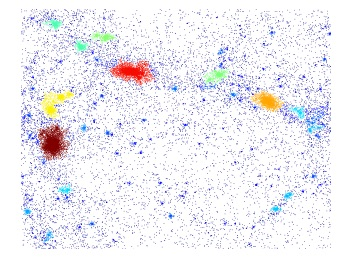

hfof
======

### Friends of Friends group finding via spatial hashing


hfof is an open-source friends-of-friends (FoF) group finder in 3d and 2d (periodic and non-periodic), based on the following paper: [arxiv:1805.04911](https://arxiv.org/abs/1805.04911).

Once you have downloaded hfof you will probably want to do the following:

## Install

Install (also builds the C-functions)

```bash
python setup.py install [--prefix=/myhome/my-site-packages]
```
and run the tests,
```bash
python setup.py test
```

## Examples
These probably need at least python 2.7 and a (non-ancient) numpy and scipy. 

### Labal an example set of particles with by their connectivity
    
In a python environment try
    
```python
from hfof import fof, example_data
import numpy as np

pos = example_data.get_pos() # (32768,3) positions in [0,1]
pos[:,2] *= 0.0 # project (squash) z-dimension
r_cut = 0.004 # linking length

fof_labels = fof(pos, r_cut, boxsize=1.0) # integer labels from 0...

# color by number of particles in group
clrs = np.bincount(fof_labels)[fof_labels]
import pylab as pl
pl.scatter(pos[:,0],pos[:,1], c=np.power(clrs,0.3), s=1.0, edgecolors='none')
pl.show()
```

All of these are equivalent to running

```
python examples/example1.py
```

If you only want to do clustering on 2-d data I have now added the function
```python
# pos an (N,2) array of positions
fof_labels = fof2d(pos, r_cut, boxsize=None) # integer labels from 0...
```

## Notes on the 2d implementation in version 0.2
The 2d FoF (function `fof2d`) is not described in the paper mentioned above, although it broadly follows the same
methodology as the 3d. The 2d domain is split in blocks which are further decomposed into 8x8 (=64) cells. The blocks are
entered into a hash-table, and as each point is added to a cell, we test for connection against the neighbouring cells. 
In 2d this involves checking 10 neighbouring cells (excluding itself, and all those with larger indices), which can be
found in (up to) 4 blocks (including itself). 

The code to pre-compute the neighbour masks is given in `hfof\ngb_vals.py` and the actual computation is done in `src\fof64_2d.c`.